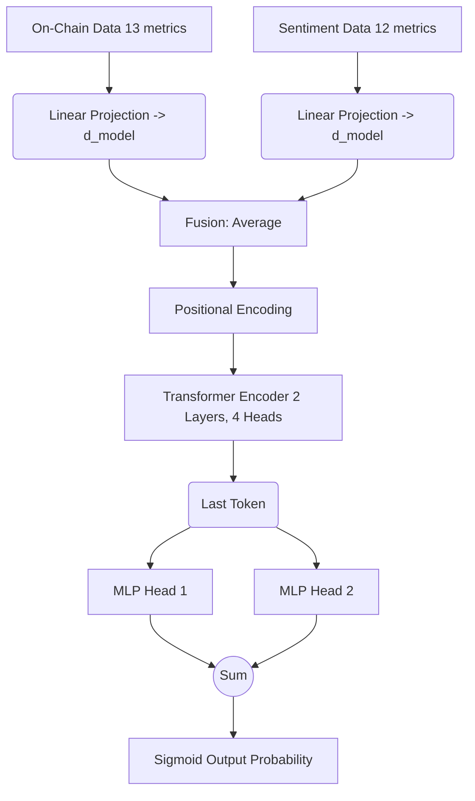

## 🧠 Overview

**NeuralEdge** is an AI-powered cryptocurrency forecasting platform designed to predict whether the price of Bitcoin (BTC) will go **UP or DOWN tomorrow**. 

Developed as an academic research project, it answers the critical question: *Can the fusion of on-chain blockchain data and behavioral market sentiment outperform traditional price-based models?*

By utilizing a state-of-the-art **Dual-Head Transformer**, NeuralEdge processes structured network fundamentals and unstructured market psychology in parallel, successfully mitigating the directional bias common in highly imbalanced cryptocurrency datasets.

## ✨ Features

- **Dual-Head Transformer Architecture**: A custom PyTorch model fusing 13 on-chain metrics with 12 sentiment indicators.
- **Automated Data Pipeline**: A one-click daily ingestion script (`daily_predict.py`) that fetches fresh OHLCV, CoinMetrics on-chain data, Alternative.me Fear & Greed indices, and Google Trends search volume.
- **Bias Mitigation**: Implements soft class weighting (square root scaling) and mathematically calibrated thresholding to balance recall across market directions.
- **FastAPI Backend**: A lightweight, robust API serving live predictions and historical backtesting data.
- **Interactive Terminal UI**: A premium, "glassmorphism" web dashboard built with vanilla JavaScript and TailwindCSS, featuring live price tickers, SVG neural inference charts, and real-time probability readouts.
- **Trading Simulator & Engine Room**: Additional frontend modules for strategy backtesting and visualization of internal model state vectors.

## 🏗️ Architecture



## 📊 Performance Metrics

The production model (Fine-Tuned v1.0) achieves the following frozen metrics on the out-of-sample test set (2018–2026 data):

- **Test Accuracy:** 57.46%
- **F1 Score:** 0.54
- **Recall (UP):** 65%
- **Recall (DOWN):** 53%
- **Optimal Threshold:** 0.27 (calibrated to maximize balanced F1)

## 🚀 Quick Start

### 1. Prerequisites
Ensure you have Python 3.12+ and `uv` (the fast Python package installer) installed on a Linux environment.

### 2. Installation
Clone the repository and run the magic startup script. This will set up the virtual environment, install dependencies, and launch both the backend and frontend.

```bash
git clone https://github.com/yourusername/NeuralEdge.git
cd NeuralEdge
source .venv/bin/activate
./launch_neuraledge.sh
```

### 3. Access the Platform
Once launched, the ecosystem is fully synchronized:
- **Terminal Dashboard**: [http://localhost:8000/terminal.html](http://localhost:8000/terminal.html)
- **API Status**: [http://localhost:8002/](http://localhost:8002/)

## ⚙️ Daily Operations

To generate tomorrow's prediction, run the daily pipeline script. This updates all four CSV data sources and executes the inference engine:

```bash
cd Backend/Core_API_Service
python scripts/daily_predict.py
```

After updating the data, restart the dashboard to reflect the new state:
```bash
cd ../..
./launch_neuraledge.sh
```

## 📁 Repository Structure

```text
NeuralEdge/
├── Backend/
│   ├── Core_API_Service/      # Primary working directory (API, data, scripts)
│   │   ├── scripts/           # FastAPI, prediction logic, and data updaters
│   │   ├── data/              # CSV stores for OHLCV, On-chain, Sentiment, Google
│   │   └── models/            # Production PyTorch weights and scalers
│   └── NeuralEdge/            # Canonical model artifacts and dissertation plots
├── Frontend/
│   └── web-app/               # HTML/Tailwind/JS user interface
├── Documentation/             # Research papers, agent handoffs, and guides
├── launch_neuraledge.sh       # One-click startup script
└── pyproject.toml             # Dependency configuration
```

## 🎓 Academic Context

This project was developed for the *CN 6000 Mental Wealth Professional Life 3 - BSc Dissertation* at the University of East London. The accompanying research paper, "A Multimodal Dual-Head Transformer Architecture for Enhanced Cryptocurrency Price Prediction via On-Chain and Sentiment Fusion," demonstrates how multimodal fusion significantly outperforms single-source baseline architectures.

## ⚠️ Disclaimer

**Educational Purposes Only**: NeuralEdge is an academic research project and is not financial advice. Cryptocurrency markets are highly volatile. Do not use this model to make real-world financial or trading decisions.

---
*Created by Shyam Vijay Jagani (2611208)*
